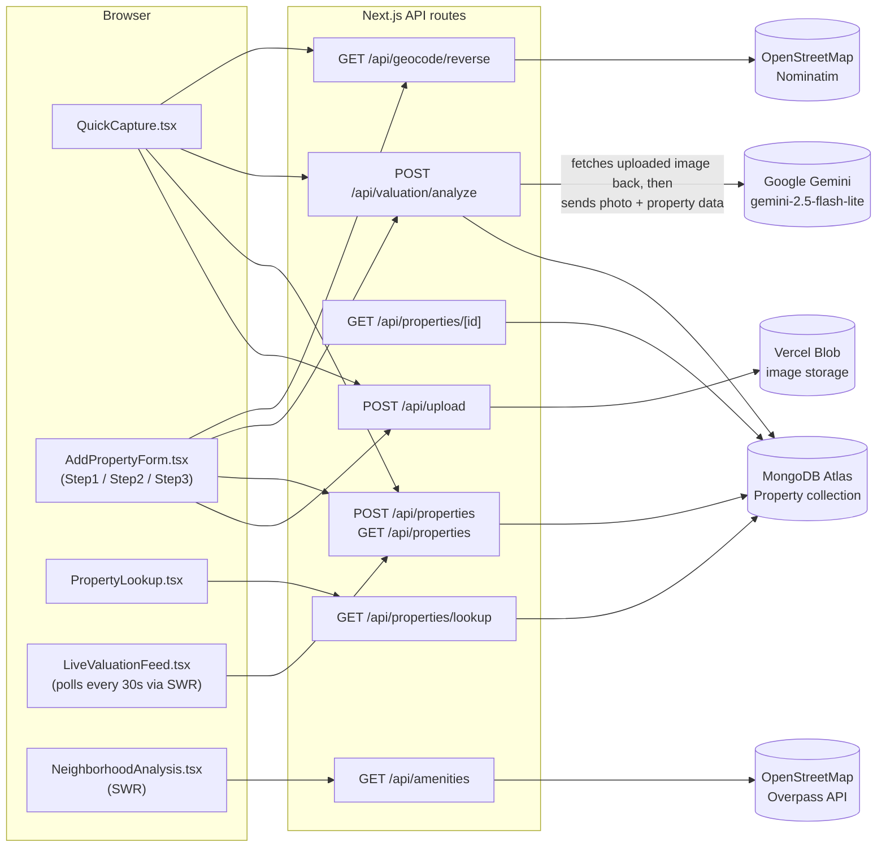
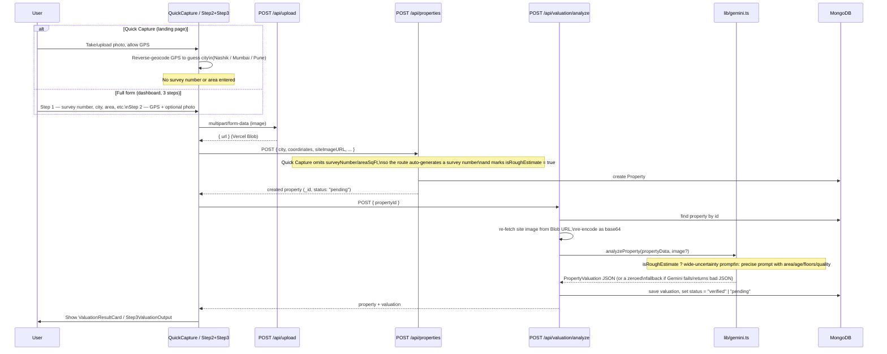
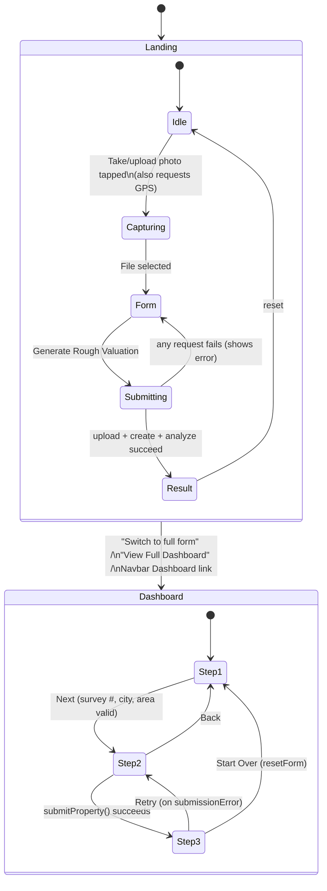
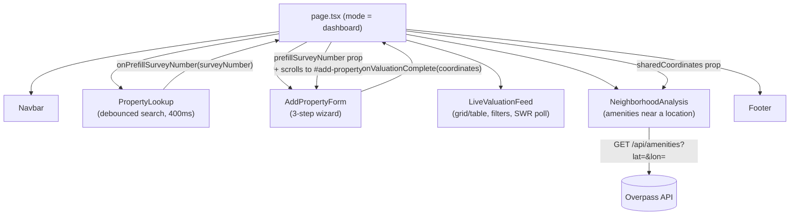

# ValuateAI

AI-powered valuation for industrial property in Maharashtra (Nashik, Mumbai, Pune). Point a camera at a site and get a rough estimate from a photo and GPS location, or fill in a full property form for a precise, Gemini-generated valuation with neighborhood amenity data.

Built with **Next.js 16 (App Router)**, **React 18**, **TypeScript**, **Tailwind CSS 3**, **MongoDB (Mongoose)**, **Google Gemini** (`@google/generative-ai`), and **Vercel Blob** for image storage.

---

## 1. Setup

**Requirements:** Node.js 18 or newer, a MongoDB Atlas connection string, a Gemini API key, and a Vercel Blob read/write token.

```bash
git clone https://github.com/omdesale777/Valuate-AI.git
cd Valuate-AI
npm install
```

There's no `.env.example` in the repo, so create `.env.local` yourself with:

```env
MONGODB_URI=mongodb+srv://<user>:<password>@cluster0.xxxxx.mongodb.net/valuateai?retryWrites=true&w=majority
GEMINI_API_KEY=AIza...
BLOB_READ_WRITE_TOKEN=vercel_blob_rw_...
```

Then:

```bash
npm run dev
```

Open **http://localhost:3000**.

Optionally seed 15 sample properties (5 each in Nashik, Mumbai, Pune):

```bash
npm install -D ts-node   # not a listed dependency, so install it first
npm run seed
```

## 2. Scripts

| Command         | What it does                                              |
| ----------------- | ------------------------------------------------------------ |
| `npm run dev`    | Starts the dev server with hot reload                       |
| `npm run build`  | Creates a production build                                  |
| `npm start`      | Runs the production build                                   |
| `npm run lint`   | Runs `next lint`                                             |
| `npm run seed`   | Clears the `properties` collection and inserts 15 sample rows |

## 3. Architecture

The browser never calls Gemini, MongoDB, or the OpenStreetMap services directly — everything goes through the app's own API routes.



## 4. Valuation request flow

Both entry points — the one-tap Quick Capture on the landing page and the 3-step form on the dashboard — end up calling the same three endpoints in sequence. They differ only in what data they send.



## 5. UI flow

The home page (`app/page.tsx`) has exactly one top-level state, `mode: "landing" | "dashboard"`. Each mode owns its own, separate state machine underneath.



Two things worth calling out because they aren't obvious from the UI alone:

- **`useCameraCapture` (in `hooks/`) is dead code.** Both `QuickCapture.tsx` and `Step2SiteCapture.tsx` implement their own file-input/preview-URL logic inline instead of using it — it isn't imported anywhere in the app.
- **Quick Capture and the full form use two independent `useGeolocation()` instances.** GPS permission granted on the landing page does not carry over if you switch to the dashboard form; it asks again.

## 6. Dashboard composition & data sharing

Once `mode` is `"dashboard"`, `page.tsx` renders five sections in a fixed order and threads two pieces of state between them:



In words: searching for a survey number in **Property Lookup** that doesn't exist yet scrolls you to **Add Property** with that number pre-filled. Completing a valuation in **Add Property** hands its GPS coordinates to **Neighborhood Analysis**, which only fetches amenity data once it has received coordinates from somewhere.

## 7. Project structure

```
Valuate-AI/
├── app/
│   ├── api/
│   │   ├── properties/route.ts           # GET (list, paginated/filtered) · POST (create)
│   │   ├── properties/[id]/route.ts      # GET one property
│   │   ├── properties/lookup/route.ts    # GET search by survey #, name, locality
│   │   ├── valuation/analyze/route.ts    # POST — runs Gemini and saves the result
│   │   ├── upload/route.ts               # POST — image to Vercel Blob (5MB max)
│   │   ├── amenities/route.ts            # GET — Overpass amenities near a point
│   │   └── geocode/reverse/route.ts      # GET — Nominatim reverse geocode
│   ├── page.tsx                          # Landing/dashboard mode switch
│   ├── layout.tsx, loading.tsx, error.tsx
│   └── globals.css
│
├── components/
│   ├── sections/
│   │   ├── QuickCapture.tsx              # Landing page: photo + GPS → rough valuation
│   │   ├── PropertyLookup.tsx            # Debounced survey-number/name search
│   │   ├── AddPropertyForm.tsx           # Wraps the 3-step wizard, step indicator
│   │   ├── LiveValuationFeed.tsx         # Paginated/filterable property feed
│   │   └── NeighborhoodAnalysis.tsx      # Amenity cards for a set of coordinates
│   ├── forms/
│   │   ├── Step1PropertyDetails.tsx
│   │   ├── Step2SiteCapture.tsx          # GPS + optional photo (own useGeolocation)
│   │   └── Step3ValuationOutput.tsx
│   ├── cards/
│   │   ├── PropertyCard.tsx
│   │   └── ValuationResultCard.tsx
│   ├── layout/
│   │   ├── Navbar.tsx
│   │   └── Footer.tsx
│   └── ui/
│       ├── index.tsx                     # Button, GlassCard, StatusBadge, GradeTag, ProgressRing, SkeletonCard
│       ├── FormComponents.tsx
│       └── Toast.tsx
│
├── hooks/
│   ├── useGeolocation.ts                 # GPS + reverse geocode
│   ├── usePropertyForm.ts                # 3-step wizard state + submitProperty()
│   ├── useValuationFeed.ts               # SWR list state, filters, pagination
│   └── useCameraCapture.ts               # Defined, but not imported anywhere
│
├── lib/
│   ├── mongodb.ts                        # Cached Mongoose connection
│   ├── gemini.ts                         # Builds the rough/precise prompt, calls Gemini
│   ├── overpass.ts                       # Amenity queries + connectivity score
│   ├── nominatim.ts                      # Reverse geocoding
│   └── formatters.ts
│
├── models/
│   └── Property.ts                       # Mongoose schema (city, zoning, valuation, amenities...)
│
├── types/
│   └── index.ts                          # Shared TypeScript interfaces
│
├── scripts/
│   └── seed.ts                           # 15 sample properties (5 per city)
│
└── public/                                # Default Next.js icons (unchanged from scaffold)
```

## 8. Configuration & market data

These numbers are hardcoded in `lib/gemini.ts`'s prompt and in `models/Property.ts`'s schema, not in a central config file:

| Setting                     | Value                                                                 |
| ----------------------------- | ------------------------------------------------------------------------ |
| Gemini model                | `gemini-2.5-flash-lite`                                                  |
| Supported cities             | `Nashik`, `Mumbai`, `Pune` (enforced by the Mongoose schema's `enum`)    |
| Zoning types                 | `Industrial`, `Commercial`, `Mixed`, `Warehousing`                       |
| Ownership types               | `Freehold`, `Leasehold`, `Government`                                    |
| Investment grades             | `A`, `B+`, `B`, `C`, `D`                                                  |
| Max upload size               | 5 MB, images only                                                         |
| Amenity radius (bank/ATM)     | 1 km                                                                       |
| Amenity radius (hospital/school) | 2 km                                                                    |
| Amenity radius (transport)     | 1.5 km                                                                    |
| Property list page size       | 12                                                                         |
| Live feed poll interval       | 30 seconds                                                                 |

Rate ranges the Gemini prompt is told to anchor to (2024–25 Maharashtra industrial market):

| City   | Zone                    | Rate range          |
| ------- | ------------------------- | ---------------------- |
| Nashik | MIDC Industrial          | ₹800 – ₹2,500 / sq ft  |
| Pune   | Industrial Corridors      | ₹1,500 – ₹4,500 / sq ft |
| Mumbai | Suburban Industrial       | ₹3,000 – ₹8,000 / sq ft |

## 9. API reference

| Method | Endpoint                          | Description                                            |
| -------- | ------------------------------------ | ---------------------------------------------------------- |
| `GET`  | `/api/properties`                 | Paginated list, filterable by `city`, `zoningType`, sortable |
| `POST` | `/api/properties`                 | Create a property (auto-generates survey # / area if omitted) |
| `GET`  | `/api/properties/[id]`             | Fetch a single property                                  |
| `GET`  | `/api/properties/lookup?q=`        | Search by survey number, name, or locality                 |
| `POST` | `/api/valuation/analyze`           | Runs Gemini on a property and saves the result             |
| `POST` | `/api/upload`                       | Upload a site image to Vercel Blob                          |
| `GET`  | `/api/amenities?lat=&lon=`          | Nearby banks/hospitals/schools/transport via Overpass       |
| `GET`  | `/api/geocode/reverse?lat=&lon=`    | Reverse geocode via Nominatim                                |

## 10. Troubleshooting

| Problem                                       | Fix                                                                          |
| ------------------------------------------------ | -------------------------------------------------------------------------------- |
| App crashes on startup: `MONGODB_URI is not defined` | `lib/mongodb.ts` throws at import time if it's missing — set it in `.env.local`. |
| App crashes on startup: `GEMINI_API_KEY is not defined` | Same — `lib/gemini.ts` throws at import time. Restart `npm run dev` after adding it. |
| Valuation comes back all zeros, grade `C`         | Gemini's response failed to parse as JSON, or the API call itself failed — `analyzeProperty()` silently falls back to a zeroed result rather than erroring. Check the server console. |
| Upload fails with "File too large"                | `/api/upload` rejects anything over 5 MB.                                       |
| Camera doesn't open on a deployed site            | `capture="environment"` needs HTTPS — test on your Vercel URL, not a plain HTTP host. |
| `npm run seed` fails / hangs on a prompt          | `ts-node` isn't a listed dependency — run `npm install -D ts-node` first.        |
| Neighborhood Analysis section stays empty          | It only fetches once `coordinates` are passed in from a completed valuation in **Add Property** — it has no independent way to get a location. |

## 11. Status notes

Things worth knowing that the code shows but the marketing copy in the previous README didn't mention:

- **No `LICENSE` file exists**, despite the badge in the old README linking to one.
- **No `.env.example` file exists** — you have to create `.env.local` from the snippet above (or the old README's).
- The old README's tech-stack table said **Next.js 14.2**; `package.json` currently pins **`next: ^16.2.1`**.
- `NEXT_PUBLIC_APP_URL` and `NEXT_PUBLIC_APP_NAME` are listed as env vars in the old README but **aren't read anywhere in the codebase**.
- `hooks/useCameraCapture.ts` is **fully implemented but never imported** — both capture flows re-implement the same logic inline instead.
- The old README's **"Live Demo" link points to `#`** (a placeholder, not a real deployment).
- The **Roadmap section** (WhatsApp sharing, PDF export, broker marketplace, historical tracking, Tier-2 cities, comparable sales, multi-language) is aspirational — none of it exists in the current code. It's fine to keep as a roadmap, just don't read it as shipped functionality.
- Everything described in sections 3–9 above, by contrast, is implemented and working end-to-end.
